# Space Sounds!

## Motivation for Development
Space missions from companies such as NASA, SpaceX, Virgin Galactic and Blue Origin has made the desire to go to space increase exponentially over the past couple of years.  We would like to make that dream realistic for everyone!

## User Story
AS A User
I WANT to see an image from space
SO THAT when I click on a button, I see an image from space with a correlating sound and video

## Built with 
* YouTube Data API v3
* NASA Image and Video Library API
* GitHub
* Bttn.css
* BootStrap
* JavaScript
* HTML
* CSS

## Roles

### Claudia
* Frontend 
* Setting up homepage using HTML
* Styling the homepage 
* Researching different CSS frameworks and documentation

### Sarah 
* Frontend
* Setting up GitHub repo
* Publishing to Pages in GitHub
* Setting up homepage background video 
* Styling the homepage. 

### Anthony
* Backend
* Researching APIs and their documentation
* Calling and Retrieving data from the both server side APIs
* Dynamically adding HTML elements using JavaScript.

## Website
https://sarahhart1997.github.io/space-sounds/ 

## Images with Descriptions

### Displays Homepage

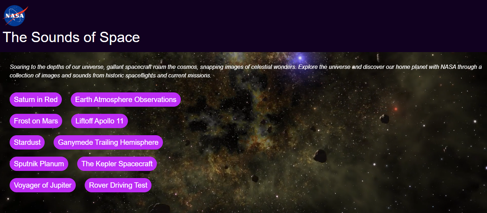 

### Saturn in Red

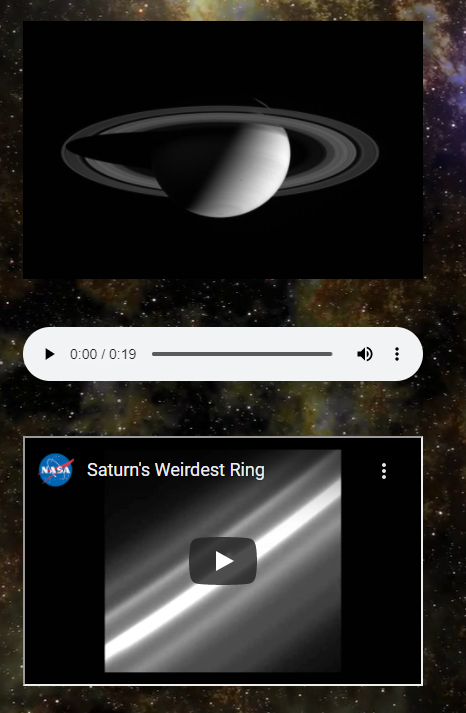

### Earth Atmosphere Observations

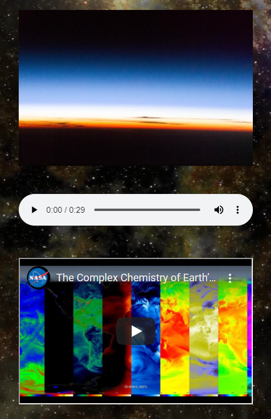

### Frost on Mars

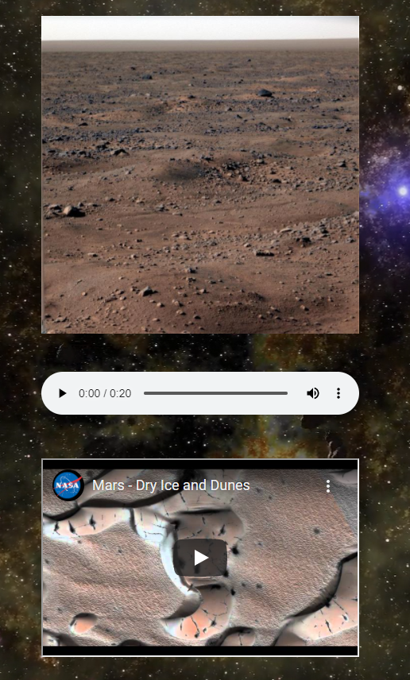

### Litfoff Apollo 11

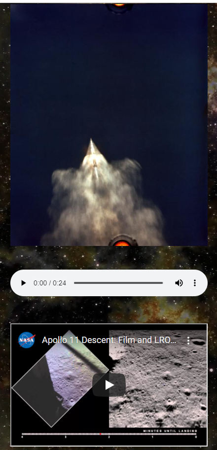

### Stardust

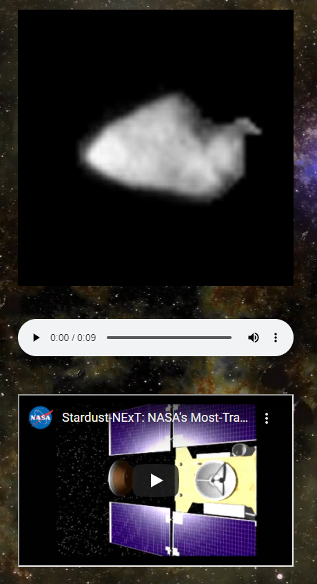

### Ganymede Trailing Hemisphere

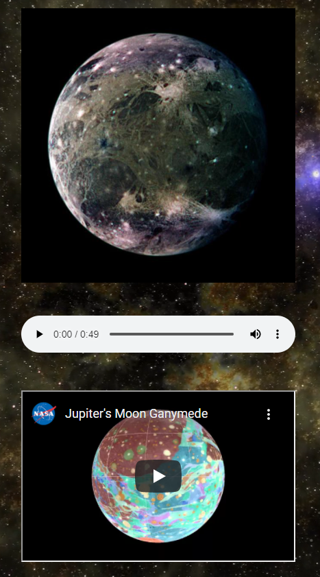

### Sputnik Planum

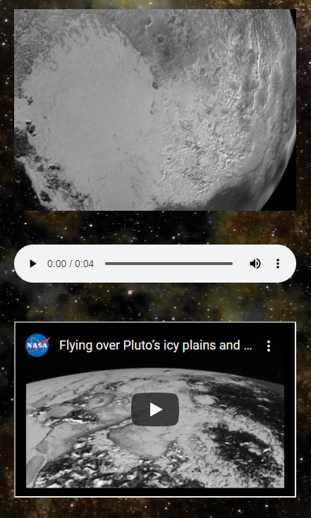

### The Kepler Spacecraft

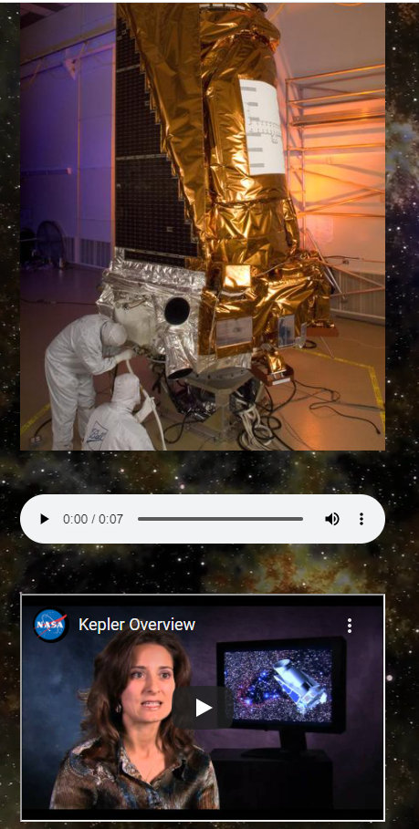

### Voyager of Jupiter

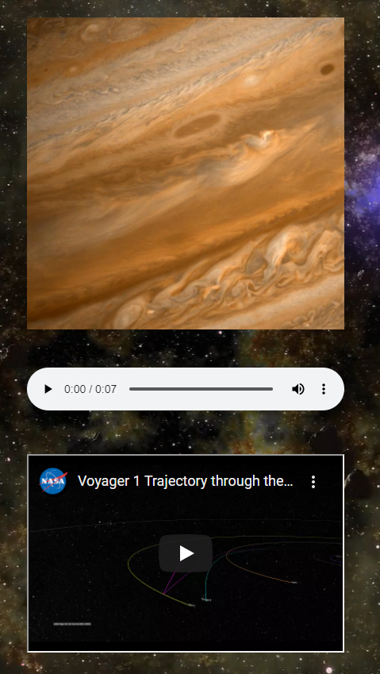

### Rover Driving Test

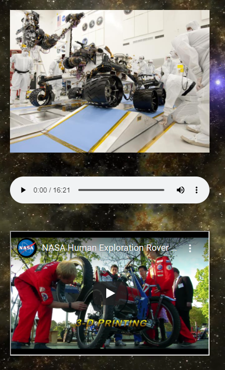

## Contribution
Made by Claudia Davis, Sarah Hart and Anthony Marrocco

### &copy; Group 6